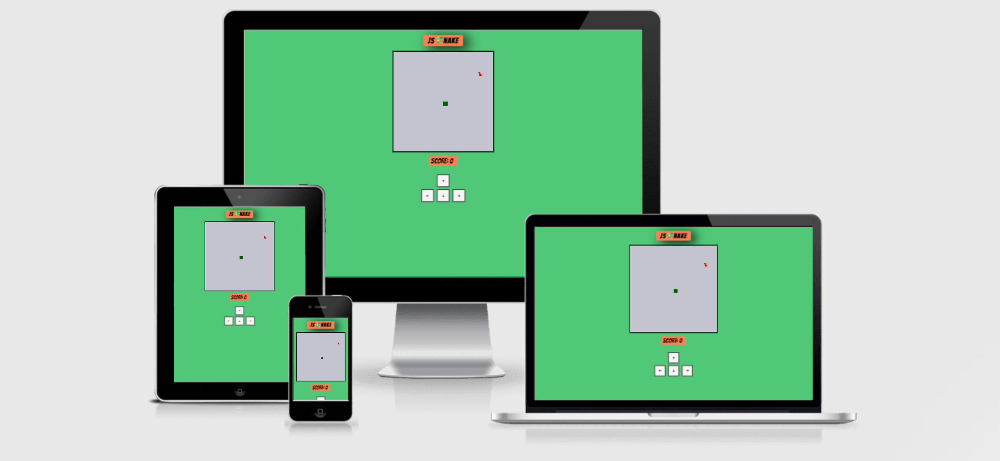
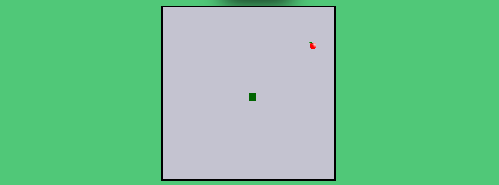
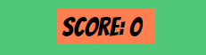
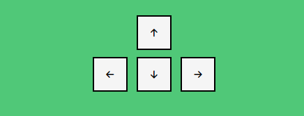
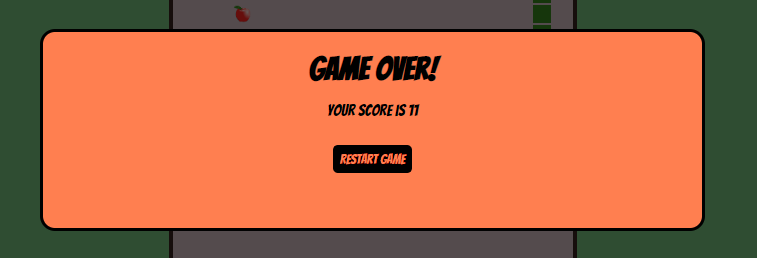
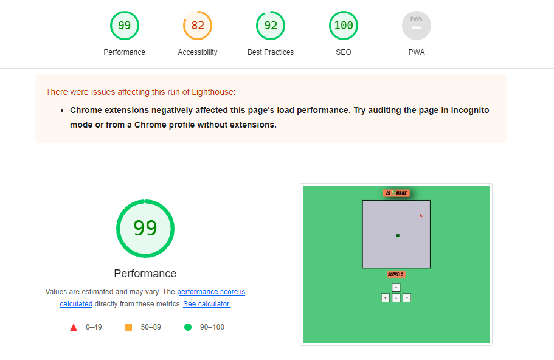

# **JS nake**

Click here to go to the webpage [JS Snake](https://claudio-cruz.github.io/js-snake/)

JS Snake is a classic snake game that we have all played once in our lives. It's extremely simple but very fun to play. The game starts with a snake moving around a square, and the goal of the game is to make the snake eat as many apples as you can. The game might look easy in the beginning, but the snake increases its size and speed while your score increases. You lose the game if the snake touches its own body or the walls.

## Features

- __Game field__

  - The game field is where all the game action happens. It's a square on the screen and the snake can't go out of it or it's game over.
  - The snake has to eat the apple to increase the score. The apple appears randomly in the game fiel.
  - The snake's size and speed increase when the snake eats the apples, increasing the difficulty.

- __Score__

  - The score increases every time the snake eats an apple.
  - It gives the users a better experience playing the game while seeing the live score.

- __Controls__

  - The controls allow the users to play on touch-screen devices like tablets and smartphones.
  - It improves the players' experience for those that like to play with the mouser instead of the keyboard.

- __Game over__

  - Every time the players hit the walls or the snake's body, the game ends with a text of the score on a game over window.
  - On the game over window, the players can click on the option button "Restart Game" to be able to play again.

- __Features left to implement__

  - In the future, updates will be implemented for a top ten score with the payer's nick names.
  - The users will be able to login with their nick names and pictures.
  - It will increase the difficulty levels for pro players by increasing the speed and obstacles.
  - New maps will be added.
  - The snake body will have a new realistic style.

## Testing

  - This game works in different browsers: Microsoft Edge, Chrome, Opera, Firefox and Safari.
  - This game works on different screen sizes; big computer screens, laptops, tablets, and smartphones.
  - The game doesn't break or return any errors on the different devices.

## Bugs

- __Solved bugs__

  - When I drew an apple image on the canvas game field instead of the red square, the game stopped working, but after I rearranged the function and the code indentation, it started to work again.
  - When i added the modal game over box, the game over box didn't show up, but after correcting the function, it worked well.
  - When I added the if game over condition function, the game returned game over from the start. I corrected that bug with a new line of code that smakes the game over function only apply after the snake starts to move.
  - The code was analyzed with JSHint, and it found no errors or warnings. I added a comment to the top of my .js file (/*jshint esversion: 6 */
) to use version 6 of JavaScript.

## Validator Testing

- __HTML__
  - No errors were return in the HTML page, when passing through the official W3C HTML Validator [W3C HTML Validator](https://validator.w3.org/nu/?doc=https%3A%2F%2Fclaudio-cruz.github.io%2Fjs-snake%2F)

- __CSS__

  - No errors were returned when passing through the official [(Jigsaw) Validator](https://jigsaw.w3.org/css-validator/validator?uri=https%3A%2F%2Fclaudio-cruz.github.io%2Fjs-snake%2F&profile=css3svg&usermedium=all&warning=1&vextwarning=&lang=en)

- __Javascript__

  - No errors were returned when passing through the official [Jshint Validator](https://jshint.com/)

- __Accessibility__

  - By running it through the lighthouse in Devtolls, I confirmed that the website is easy to read with different colour contrasts, font contrasts and sizes.

- __Unsolved bugs__

  - The game has a bug where sometimes when the snake eats the apple, the new apple is drawn randomly under the snake's body, stopping us from seeing the apple, but after the snake moves away, the players can see the apple.

## Deployment

- The site was deployed to GitHub pages. The steps to deploy are as follows:
- In the GitHub repository, go to the Settings tab.
- On the menu on the left side select Pages, to open GitHub Pages.
- In the GitHub pages section, select Branch and changed to Main. That way, GitHub published the website in the repository, giving the link to the website.

The link can be found here - [SJ Snake](https://claudio-cruz.github.io/js-snake/).

## Credits

- __Content__
  - The game was inspirer in the tutorial javascript video [Youtube](https://www.youtube.com/watch?v=7Azlj0f9vas).
  - The icons were taken from [Fontawesome](https://fontawesome.com/).

- __Media__
  - The favicon images were taken from [Iconarchive](https://iconarchive.com/show/noto-emoji-animals-nature-icons-by-google/22285-snake-icon.html).  
